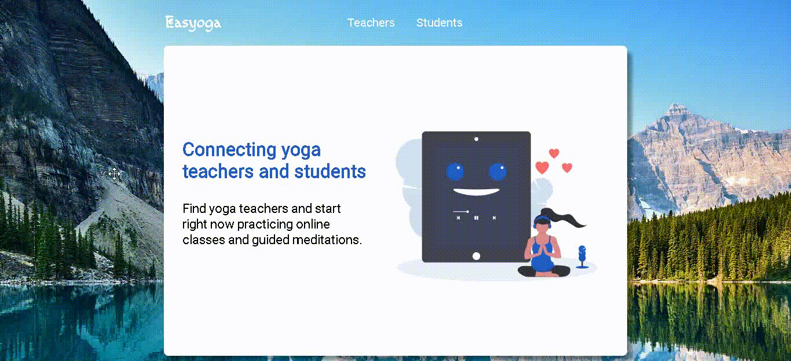

<h1 align="center">Easyoga</h1>

<h1 align="center">
    
</h1>

<h3 align="center"> 
	Status: under construction :warning:
</h3>

<p align="center">
<a href="https://github.com/cassiocappellari/easyoga-app/commits/master">
	
</a>
    


<a href="https://github.com/cassiocappellari/easyoga-app/stargazers">
	
</a>
</p>

## 📋 Index

- [About](#-about)
- [Technologies](#-technologies)
- [How To Use](#-how-to-use)
- [Author](#-author)

## 🧘‍♀️ About

**Easyoga** is a web platform that connects yoga teachers and students with the main purpose of disseminate online practices and guided meditations. The project is a **fullstack application** (backend and frontend) developed during the coding bootcamp named LaunchBase, by [Rocketseat](https://rocketseat.com.br/).

## 🤖 Technologies

The project was developed using this technologies:

**Database:**
- [PostgreSQL](https://www.postgresql.org/)

**Back-end:**
- [Node.js](https://nodejs.org/en/)
- [Express](https://expressjs.com/)

**Front-end:**
- [HTML5](https://developer.mozilla.org/en-US/docs/Web/Guide/HTML/HTML5)
- [CSS3](https://developer.mozilla.org/en-US/docs/Archive/CSS3)
- [JavaScript](https://js.org/)
- [Nunjucks](https://mozilla.github.io/nunjucks/)

## ⚙ How to Use

```bash
# Clone this repository

$ git https://github.com/cassiocappellari/easyoga-app

# Install the dependencies

$ npm install

# Start the project

$ npm start

```

## 👨‍🚀 Author

**Cássio Cappellari**

- GitHub: [@cassiocappellari](https://github.com/cassiocappellari)
- LinkedIn: [@cassiocappellari](https://www.linkedin.com/in/cassiocappellari/)

---

Developed with 💚 by Cássio Cappellari!
